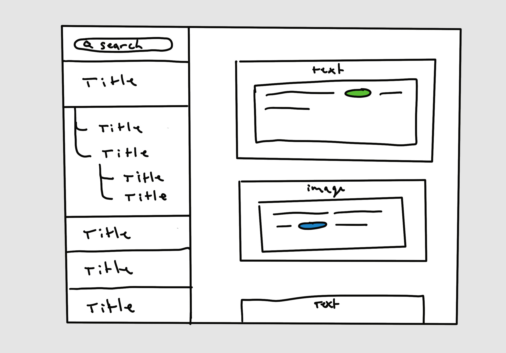

# Ada Front End Test

Welcome to the Front End Developer test! The goal of this test is to allow you to prove that you can program, as well as develop and design application interfaces. In this test, we have provided an API as well as documentation for it, and you will have to build a web interface for the aforementioned API.

This test is inspired by problems we have run into in our work and we expect you to tackle it like any other work problem. You may use any programming language as well as your favourite editor. Feel free to google-and-stackoverflow your way to success.

As for the programming challenges, we suggest you stick to the old programming mantra:

- Make it work
- Make it right
- Make it fast

The most important thing is to make it work somehow. If you then can clean it up and make it _right_, all the better. That said, we would like you to give some thought and documentation on how you would deliver your code to clients in production and let us understand the underlying assumptions of your solution. Why is this solution appropriate? How would you handle large datasets on the client? What could be potential user experience challenges in the future? How would you make this accessible? What would you change if you had more time to work on it? Please spare a few words to these assumptions and write them out; either directly as code comments or in a separate document.

As for the code, don't feel bound by what is already there. Add functions and datastructures as you see fit, and delete old code with abandon if you don't find it helpful. This is your code, so write it your way!

## The Challenges 

You are working on a database-backed web-app in which you have to fix bugs and add new functionality (sounds familiar?). We have provided you with a functional backend and database that we need you to build a frontend for. Success here is in building something functional that aligns with the design direction provided while giving us an understanding of the choices you make as you build your solution.

### Designs

Your application should look something like the sketch below. 



### Challenge 1

Build a frontend component that displays information from the /nodes endpoint according to the specification outlined in the design documents.

- When you click on an item in the list view on the left side of the app, a space between that cell and the cell beneath it should show that `node`s `connections`.

- You should then be able to click on the `node`s to reveal their `connections` as well, if they exist that is.

- When you click on a diferent item in the list, it should close the connections that you are viewing and open up the connectiuons for the node that you have clicked on.

- Any time you click on a node, it should display all of the content in the Detail View on the right side of the page.

### Challenge 2

Build an interactive front end component that works with the /search end point and displays results as outlined in the design documents.

### Challenge 3

Build an interactive front end component that renders the content using template strings.

Variables are represented inside of `node` content as a template string `{<idOFTheVariable>|a fallback value}`


## Getting Started

### Tools to help you get started

#### React

[create react app](https://reactjs.org/docs/create-a-new-react-app.html)

### API Setup and Docs
It should be simple to get the API that will get your web app data up and running:

1. `yarn`
2. `yarn start-server`

#### `GET /nodes`

Returns a shallow list of nodes with enough to render a sidebar

```
[
  {
    "id": 1,
    "title": "These are the voyages"
  },
  ...
]
```

#### `GET /nodes/:id`

returns a nodes' connections to children nodes

```
[
  {
    "id": 1,
    "title": "Data on friendship",
    "connections": [
      2, // These are ID's to other nodes
      3,
      ...
    ],
    "content": [
      {...},
      ...
    ]
  },
  ...
]
```

#### `POST /nodes/search`

returns search content related to a node


```
`POST {query: "test"}`

>>>
[
    {
        "id": 2,
        "title": "Data on friendship"
    },
    {
        "id": 5,
        "title": "Maybe Data with Beard"
    },
    {
        "id": 6,
        "title": "Borg Hails"
    }
]
```

#### `GET /variables`

returns all our variable data

```
[
  {
      "id": "74c695031a554c2ebfdb2ee123c8b4f6",
      "name": "first",
      "scope": "global"
  },
  ...
]
```

## Maintainers help

When we have a new version ready run the following script while at the repo root. WARNING this will remove any un-commited changes you may have made in the repository so ensure you commit them or are on master.

```
./scripts/package.sh
```

Which will generate the zip file that needs to be uploaded for candidates that does not include the solutions folder.
